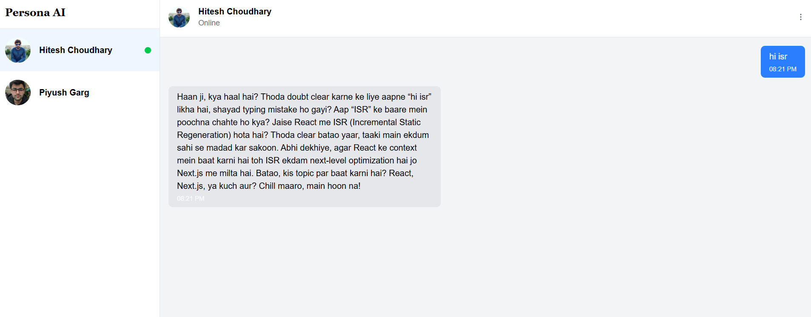

# 🤖 Persona AI Chat

> "Multi-persona conversational AI built with Next.js, React, and OpenAI."

---

## 📸 Preview



Experience human-like conversations with customizable AI personas.
---

## 🚀 Features

- 💬 **Multi-persona support** — Each persona has its own chat history and unique system prompt.  
- ⚡ **Streaming AI responses** — Real-time responses streamed token-by-token for a natural chat feel.  
- 🧠 **Per-persona memory** — Each conversation is stored and displayed independently.  
- 🪶 **Clean, modern UI** — Built with TailwindCSS and React Icons.  
- ⏱️ **Typing indicators** — “User is typing…” feedback for better interactivity.  
- 🌐 **API integration ready** — Works with any backend endpoint (e.g., `/api/chat-response`).  

---

## 🧩 Tech Stack

| Layer | Technology |
|-------|-------------|
| **Frontend** | Next.js 14, React 18 |
| **UI Styling** | TailwindCSS |
| **Icons** | React Icons (Feather, Bootstrap) |
| **State Management** | React Hooks (useState, useEffect) |
| **API Communication** | Fetch API + Streaming Response |

---

## 🧰 Installation & Setup

```yaml
# 1️⃣ Clone the repository
git clone https://github.com/your-username/persona-ai-chat.git

# 2️⃣ Navigate into the project
cd persona-ai-chat

# 3️⃣ Install dependencies
npm install

# 4️⃣ Create environment variables
touch .env.local
# Add your OpenAI key:
# OPENAI_API_KEY=your_openai_api_key_here

# 5️⃣ Run the development server
npm run dev
```


## 🌟 Future Enhancements

- 💾 **Save chat history in `localStorage`** — persist conversations across reloads and sessions.
- 🧑‍🤝‍🧑 **Add authentication** — integrate Clerk or NextAuth for per-user data and secure access.
- 🧠 **Implement long-term memory** — store and recall important context across conversations.
- 🔊 **Voice input & text-to-speech output** — support microphone input and spoken responses.
- 🪄 **Persona builder & editor** — UI to create, edit and tune persona system prompts and settings.

---

## 🧑‍💻 Author

**Dipanjan Roy**  
🎯 Engineering Student | ⚙️ Web Developer | 💡 AI Enthusiast

> _“Building AI that feels human.”_

---

## 🪪 License

This project is licensed under the **MIT License** — feel free to use and modify it.

---

## 🔖 Repo Metadata

**Tags:** `nextjs` `react` `ai-chat` `persona` `openai` `langchain` `tailwindcss` `frontend`

## 💬 Contact

📧 **Email:** [dipanjanroy2003@gmail.com](mailto:dipanjanroy.dev@gmail.com)  
🐦 **Twitter/X:** [@Dipanjan1572003](https://x.com/Dipanjan1572003)  
💻 **GitHub:** [RoyDipanjanReek](https://github.com/RoyDipanjanReek)

``` pgsql
Would you like me to include **badges** (for build status, tech stack, and license) at the top too? That makes it look even more polished — like professional open-source projects.
```
